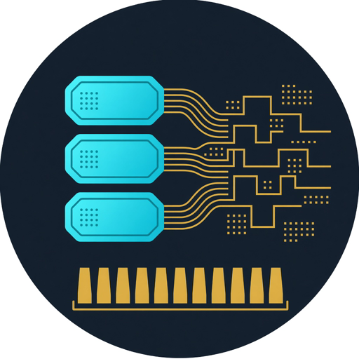

<p align="center">
  
</p>

<h1 align="center">TLP2HDL</h1>

<p align="center">
  <strong>pcieshark</strong> = Wireshark for PCIe TLPs.<br>
  <strong>TLP2HDL</strong> = <a href="https://github.com/khademullah/Pcap2HDL">Pcap2HDL</a> for those TLPs:
  replay into Verilator, watch beats on a wave, gate Match in C and HDL.
</p>

<p align="center">
  <a href="https://khademullah.github.io/TLP2HDL/">khademullah.github.io/TLP2HDL</a>
  ·
  <a href="docs/index.html">Site (local)</a>
  ·
  <a href="docs/run.html">Run book</a>
  ·
  <a href="docs/architecture.html">Architecture</a>
</p>

Replay QEMU `pci_cfg_*` logs or pcieshark CSV traces into a teaching AXI-Stream of TLP beats. A SystemVerilog header parser and Match tracker run beside the stream. The C DPI tally must agree (`mis=0`).

Waveform pedagogy matches [L2AxisBr](https://khademullah.github.io/L2AxisBr/run.html): one clock is one column; a beat counts only when `tvalid && tready`; a TLP is `tstart` through `tlast`.

## Quick start

```bash
sudo apt install build-essential verilator gtkwave   # Verilator 5.032+
cd /home/khadem/TLP2HDL
make gate
make wave    # opens simulation_trace.vcd
```

```bash
# Full pcieshark Zephyr capture
make TRACE=/home/khadem/pcieshark/zephyr_ai_topology_trace.log MAX_TLPS=200
```

All recipes are copy-paste ready in [`examples/README.md`](examples/README.md).

## Data path

1. Trace file (QEMU log or CSV)
2. DPI-C `tlp_reader.c` — parse, pack 4×32-bit beats per TLP
3. AXI-Stream `tdata/tvalid/tready/tstart/tlast`
4. `tlp_header_parser` — type, BDF, addr, payload
5. `tlp_match_tracker` — QEMU one-line cfg → `complete`
6. C vs HDL scoreboard → `[GATE] mis=0`

### Beat layout (32-bit teaching bus)

| Beat | Contents |
|------|----------|
| 0 | `type`, `dir`, `tag`, `match_hint` |
| 1 | `requester_id`, `completer_id` |
| 2 | `addr[31:0]` |
| 3 (`tlast`) | payload DWORD |

`match_hint=1` means QEMU logged the config access and its DWORD on one line (pcieshark Match = `complete`).

## Inputs

| Format | Example |
|--------|---------|
| QEMU log | `pci_cfg_read nvme 03:00.0 @0x0 -> 0x101b36` |
| CSV | `timestamp,direction,type,requester,completer,tag,length,addr,payload` |

Default sample: `traces/golden_cfg_sample.log` (slice of the pcieshark Zephyr golden fabric).

## Make targets

| Target | Meaning |
|--------|---------|
| `make` / `make run` | Compile + simulate |
| `make gate` | Fail unless `mis=0` |
| `make wave` | GTKWave on `simulation_trace.vcd` |
| `make clean` | Remove `obj_dir` and VCD |

Plusargs: `+TRACE=path` `+MAX_TLPS=N`.

## Wave tips (L2AxisBr style)

```bash
make MAX_TLPS=8 && make wave
```

1. Zoom until one 10 ns clock is one column.
2. Group `tdata`, `tvalid`, `tready`, `tstart`, `tlast`.
3. A transfer is the column where `tvalid` and `tready` are both 1.
4. One TLP is `tstart` … `tlast` (four beats).
5. Follow `hdr_valid` for decoded CfgRd/CfgWr.

## Layout

```
docs/assets/              Logo (PNG + SVG)
dpi/tlp_reader.c          DPI-C parse + beat emit + C tallies
hdl/tb_tlp_dpi.sv         Top + AXIS driver + gate
hdl/tlp_header_parser.sv  Beat → header fields
hdl/tlp_match_tracker.sv  complete / pair Match
examples/                 Copy-paste make recipes
traces/                   Sample QEMU logs / CSV
scripts/gen_tlp_csv.py    Log → CSV helper
```

## Brand assets

| File | Use |
|------|-----|
| [`docs/assets/logo.png`](docs/assets/logo.png) | README / GitHub (512²) |
| [`docs/assets/logo-web.png`](docs/assets/logo-web.png) | Site / favicon candidate |
| [`docs/assets/logo.svg`](docs/assets/logo.svg) | Flat vector mark |
| [`docs/assets/apple-touch-icon.png`](docs/assets/apple-touch-icon.png) | Touch icon |

Colors match the family: navy `#182028`, cyan `#00b0d0`, gold `#e0b018`.

## Roadmap

- **v0.1** (this tree) — QEMU/CSV replay, AXIS-TLP, Match gate, VCD, examples, logo
- **v0.2** — CSV dump round-trip, MemRd↔Cpl pairing stress, type filter
- **v0.3** — Golden fabric HDL + pcieshark GUI “Wave” pane link

Related: [pcieshark](https://github.com/khademullah/pcieshark) · [Pcap2HDL](https://github.com/khademullah/Pcap2HDL) · [L2AxisBr](https://github.com/khademullah/L2AxisBr)

## License

**[GNU Affero General Public License v3.0](LICENSE)** (AGPL-3.0-only).

This is a strong copyleft license. In short:

- You may use, study, and modify the software.
- If you distribute binaries or modified versions, you must provide complete corresponding source under AGPL-3.0.
- If you run a modified version on a server and let others interact with it over a network, you must offer them the source of that version.
- Proprietary relicensing or closed forks are not allowed without a separate commercial grant from the copyright holder.

Copyright (c) 2026 Khadem Ullah.
