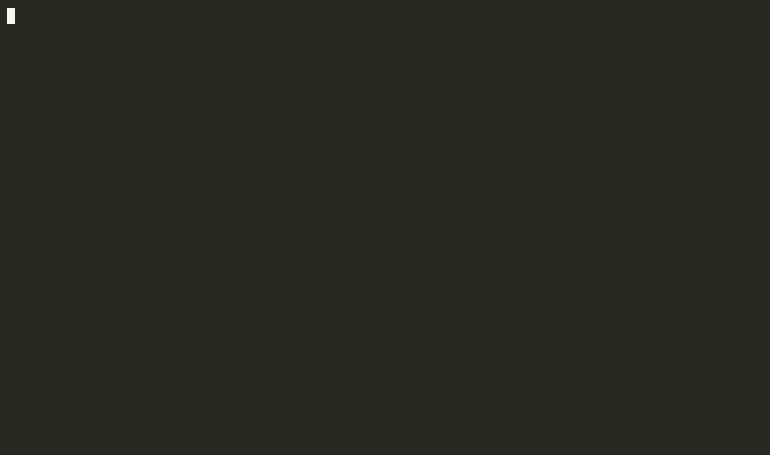
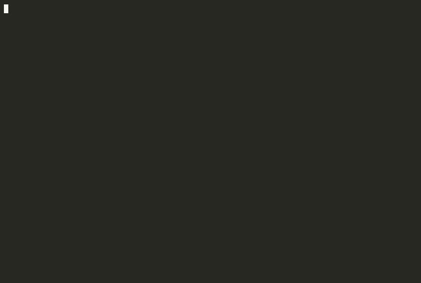

<p align="center">
  
</p>

<h1 align="center">TLP2HDL</h1>

<p align="center">
  <strong>pcieshark</strong> = Wireshark for PCIe TLPs.<br>
  <strong>TLP2HDL</strong> = <a href="https://github.com/khademullah/Pcap2HDL">Pcap2HDL</a> for those TLPs:
  replay into Verilator, watch beats on a wave, gate Match in C and HDL.
</p>

<p align="center">
  <a href="https://khademullah.github.io/TLP2HDL/">khademullah.github.io/TLP2HDL</a>
  ·
  <a href="docs/index.html">Site (local)</a>
  ·
  <a href="docs/run.html">Run book</a>
  ·
  <a href="docs/architecture.html">Architecture</a>
</p>

<p align="center">
  
</p>

<p align="center"><em><code>make dut</code> — host TLPs, DUT VendorID/DeviceID/BAR decode, <code>mis=0</code></em></p>

<p align="center">
  
</p>

<p align="center"><em><code>make dut-multi</code> — EPs <code>0100</code>/<code>0200</code>, DeviceID <code>0x000c</code>/<code>0x000d</code>, <code>mis=0</code></em></p>

Replay QEMU `pci_cfg_*` / `memory_region_ops_*` logs or pcieshark CSV traces into a teaching AXI-Stream of TLP beats. A SystemVerilog header parser and Match tracker run beside the stream. The C DPI tally must agree (`mis=0`).

Waveform pedagogy matches [L2AxisBr](https://khademullah.github.io/L2AxisBr/run.html): one clock is one column; a beat counts only when `tvalid && tready`; a TLP is `tstart` through `tlast`.

## Richer Gen3/4/5 TLP coverage from real traces (MemRd/Wr)

Teaching-AXIS coverage of **MemRd / MemWr / CfgRd / CfgWr / Cpl** from real pcieshark / QEMU captures — not a PCIe 6/7 VIP, but enough to gate memory and config TLPs the way you gate cfg today.

| Source | What you get |
|--------|----------------|
| Built-in samples | `make stress` · `make mem-gate` · `make mem-mmio` |
| Live QEMU + pcieshark | `CAPTURE_MEM=1` → CSV → `make gate TRACE=…` |
| Filters | `TYPE=MemRd,MemWr` · `--name-filter pcie,nvme,e1000` |

```bash
# --- TLP2HDL built-in Mem coverage ---
cd /home/khadem/TLP2HDL
make stress      # MemRd↔Cpl out-of-order + posted MemWr · mis=0
make mem-gate    # fabric MemRd/MemWr/Cpl sample · mis=0
make mem-mmio    # QEMU memory_region_ops_* one-liners · mis=0

# --- Capture real Gen3/4/5-style Mem + cfg from pcieshark ---
cd /home/khadem/pcieshark
CAPTURE_MEM=1 RUN_TIMEOUT_SECONDS=10 bash scripts/run_to_tlp2hdl.sh

# Or export an existing log, then gate:
python3 scripts/export_trace_csv.py out/fabric_trace.log -o out/fabric_mem.csv \
  --types MemRd,MemWr --name-filter pcie,nvme,e1000 --exclude-name pl011,gicv3
python3 scripts/export_trace_csv.py out/fabric_trace.log -o out/fabric_cfg.csv \
  --types CfgRd,CfgWr,Cpl

cd /home/khadem/TLP2HDL
make gate TRACE=/home/khadem/pcieshark/out/fabric_mem.csv MAX_TLPS=2000
make gate TRACE=/home/khadem/pcieshark/out/fabric_cfg.csv MAX_TLPS=2000
make TRACE=/home/khadem/pcieshark/out/fabric_mem.csv TYPE=MemRd,MemWr MAX_TLPS=2000 gate
```

Zephyr / Linux runners (cfg only vs cfg+Mem):

```bash
cd /home/khadem/pcieshark
CAPTURE_MEM=0 bash scripts/run_zephyr_ai_topology.sh
CAPTURE_MEM=1 RUN_TIMEOUT_SECONDS=15 bash scripts/run_zephyr_ai_topology.sh
CAPTURE_MEM=1 bash scripts/run_linux_ai_topology.sh
```

Full recipes: [`examples/README.md`](examples/README.md) §04.

## Quick start

```bash
sudo apt install build-essential verilator gtkwave   # Verilator 5.032+
cd /home/khadem/TLP2HDL
make gate
make wave    # opens simulation_trace.vcd
make stress && make mem-gate && make mem-mmio
```

```bash
# Full pcieshark Zephyr capture
make TRACE=/home/khadem/pcieshark/zephyr_ai_topology_trace.log MAX_TLPS=200
```

All recipes are copy-paste ready in [`examples/README.md`](examples/README.md).

## Data path

1. Trace file (QEMU log or CSV)
2. DPI-C `tlp_reader.c` — parse, pack 4×32-bit beats per TLP
3. AXI-Stream `tdata/tvalid/tready/tstart/tlast`
4. `tlp_header_parser` — type, BDF, addr, payload
5. `tlp_match_tracker` — QEMU one-line cfg → `complete`
6. C vs HDL scoreboard → `[GATE] mis=0`

### Beat layout (32-bit teaching bus)

| Beat | Contents |
|------|----------|
| 0 | `type`, `dir`, `tag`, `match_hint` |
| 1 | `requester_id`, `completer_id` |
| 2 | `addr[31:0]` |
| 3 (`tlast`) | payload DWORD |

Match hints (pcieshark):

| Hint | Value | Meaning |
|------|-------|---------|
| `complete` | 1 | Request with payload (QEMU one-line / RX cfg) |
| `pair` | 2 | Request without payload — open until `Cpl` |
| (none) | 0 | `Cpl` — closes by tag |

## Inputs

| Format | Example |
|--------|---------|
| QEMU cfg log | `pci_cfg_read nvme 03:00.0 @0x0 -> 0x101b36` |
| QEMU MMIO log | `memory_region_ops_read … name 'pcie-mmcfg-mmio'` → MemRd |
| CSV | `timestamp,direction,type,requester,completer,tag,length,addr,payload` |

Supported TLP types: **MemRd, MemWr, CfgRd, CfgWr, Cpl**.  
Match: posted Wr → `complete`; empty Rd → `pair` until `Cpl`; one-line QEMU Rd/Wr with data → `complete`.

Default sample: `traces/golden_cfg_sample.log`. Mem samples: `memrd_cpl_stress.csv`, `mem_fabric_sample.csv`, `mem_mmio_qemu_sample.log`.

## Make targets

| Target | Meaning |
|--------|---------|
| `make` / `make run` | Compile + simulate |
| `make gate` | Fail unless `mis=0` |
| `make stress` | MemRd↔Cpl + MemWr stress |
| `make mem-gate` | Fabric MemRd/MemWr/Cpl sample |
| `make mem-mmio` | QEMU `memory_region_ops_*` → Mem |
| `make csv-gate` | Full pcieshark `pcie_trace.csv` |
| `make dut` | Teaching endpoint DUT (cfg + Cpl) |
| `make dut-multi` | Two-BDF fabric demo (`0100,0200`) |
| `make dump-roundtrip` | Dump CSV → replay → gate |
| `make wave` | GTKWave on `simulation_trace.vcd` |
| `make clean` | Remove `obj_dir` and VCD |

Plusargs / make vars: `TRACE=` `MAX_TLPS=` `TYPE=CfgRd,Cpl,MemRd,MemWr` `DIR=TX` `DUMP=out.csv` `DUT_BDF=0300` `DUT_BDFS=0100,0200`.

### Endpoint DUT

Not a NIC/PHY — a **config-space slave** on the teaching AXIS. Host PAIR `CfgRd` to `DUT_BDF` → DUT emits `Cpl`; `CfgWr` updates the image (including BAR `0xffffffff` sizing). Capture Cpls are dropped so Match closes on DUT completions.

```bash
make dut
make dut-multi
# or against a real capture slice:
make TRACE=/home/khadem/pcieshark/pcie_trace.csv DUT_BDF=0100 MAX_TLPS=4000
make TRACE=/home/khadem/pcieshark/pcie_trace.csv DUT_BDFS=0100,0200 MAX_TLPS=4000
```

## Wave tips (L2AxisBr style)

```bash
make MAX_TLPS=8 && make wave
```

1. Zoom until one 10 ns clock is one column.
2. Group `tdata`, `tvalid`, `tready`, `tstart`, `tlast`.
3. A transfer is the column where `tvalid` and `tready` are both 1.
4. One TLP is `tstart` … `tlast` (four beats).
5. Follow `hdr_valid` for decoded CfgRd/CfgWr.

## Layout

```
docs/assets/              Logo (PNG + SVG)
dpi/tlp_reader.c          DPI-C parse + beat emit + C tallies
hdl/tb_tlp_dpi.sv         Top + AXIS driver + gate
hdl/tlp_header_parser.sv  Beat → header fields
hdl/tlp_match_tracker.sv  complete / pair Match
hdl/tlp_cfg_dut.sv        Teaching endpoint (cfg space + Cpl)
hdl/tlp_cfg_fabric.sv     Multi-BDF wrapper (≤8 EPs)
examples/                 Copy-paste make recipes
traces/                   Sample QEMU logs / CSV / DUT / multi-DUT
scripts/gen_tlp_csv.py    Log → CSV helper
```

## Brand assets

| File | Use |
|------|-----|
| [`docs/assets/logo.png`](docs/assets/logo.png) | README / GitHub (512²) |
| [`docs/assets/logo-web.png`](docs/assets/logo-web.png) | Site / favicon candidate |
| [`docs/assets/logo.svg`](docs/assets/logo.svg) | Flat vector mark |
| [`docs/assets/apple-touch-icon.png`](docs/assets/apple-touch-icon.png) | Touch icon |

Colors match the family: navy `#182028`, cyan `#00b0d0`, gold `#e0b018`.

## Roadmap

- **v0.1** — QEMU/CSV replay, AXIS-TLP, Match gate, VCD, examples, logo
- **v0.2** — pcieshark CfgRd↔Cpl Match, MemRd stress, TYPE/DIR filter, CSV dump, **cfg endpoint DUT**
- **v0.3** — Golden fabric / multi-BDF + pcieshark GUI “Wave” pane link

Related: [pcieshark](https://github.com/khademullah/pcieshark) · [Pcap2HDL](https://github.com/khademullah/Pcap2HDL) · [L2AxisBr](https://github.com/khademullah/L2AxisBr)

## License

**[GNU Affero General Public License v3.0](LICENSE)** (AGPL-3.0-only).

This is a strong copyleft license. In short:

- You may use, study, and modify the software.
- If you distribute binaries or modified versions, you must provide complete corresponding source under AGPL-3.0.
- If you run a modified version on a server and let others interact with it over a network, you must offer them the source of that version.
- Proprietary relicensing or closed forks are not allowed without a separate commercial grant from the copyright holder.

Copyright (c) 2026 Khadem Ullah.
